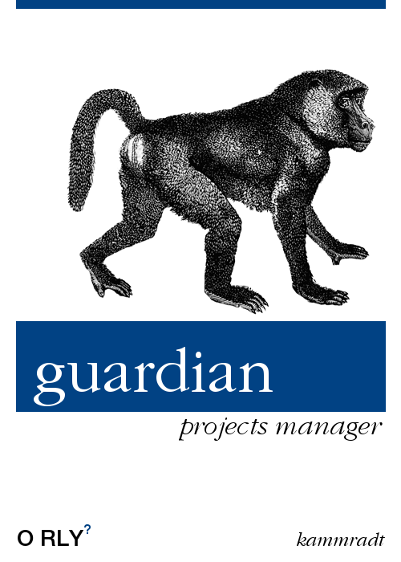

<h1 align="center">Welcome to the Guardian 🛡️</h1>

<p align="center">
  
</p>

> Just a study using Nginx for mapping all projects

## Why ❓

> The idea is to use this project to study Nginx and related technologies.

## Documentation :pencil:
- :construction:

## Usage

```sh
make guard
```

## Author

👤 **Vinicius Kammradt**

* [Website](https://kammradt.now.sh)
* [Twitter](https://twitter.com/kammzinho)
* [Github](https://github.com/kammradt)
* [LinkedIn](https://linkedin.com/in/vinicius-kammradt)

## Show your support

Give a ⭐️ if this project helped you!

***
